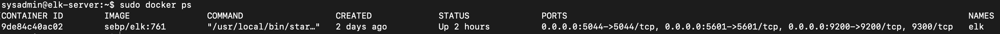

## Automated ELK Stack Deployment

The files in this repository were used to configure the network depicted below.


These files have been tested and used to generate a live ELK deployment on Azure. They can be used to either recreate the entire deployment pictured above. Alternatively, select portions of the Ansible file may be used to install only certain pieces of it, such as Filebeat.

  - [Install ELK Ansible file](Ansible/install_elk.yml)
  - [Install Filebeat file](Ansible/filebeat_playbook.yml)
  - [Install Metricbeat file](Ansible/metricbeat_playbook.yml)

This document contains the following details:
- Description of the Topology
- Access Policies
- ELK Configuration
  - Beats in Use
  - Machines Being Monitored
- How to Use the Ansible Build


### Description of the Topology

The main purpose of this network is to expose a load-balanced and monitored instance of DVWA, the Damn Vulnerable Web Application.

Load balancing ensures that the application will be highly available, in addition to restricting access to the network.
- What aspect of security do load balancers protect? What is the advantage of a jump box?
	- Load balancers distribute traffic so no one server is over loaded with traffic and can help prevent DoS attacks.
	- The use of a jump box restricts access to your virtual network which provides better security.

Integrating an ELK server allows users to easily monitor the vulnerable VMs for changes to the system and system resources.
- Filebeat watches for various types of log files and sends them to Elasticsearch or Logstash for indexing.
- Metricbeat records data from the operating system and services running on the server.

The configuration details of each machine may be found below.

| Name     | Function    | IP Address | Operating System |
|----------|-------------|------------|------------------|
| Jump Box | Gateway     | 10.0.0.4   | Linux            |
| WEB-1    | DVMA Server | 10.0.0.5   | Linux            |
| WEB-2    | DVMA Server | 10.0.0.6   | Linux            |
| ELK      | ELK Server  | 10.1.0.4   | Linux            |

### Access Policies

The machines on the internal network are not exposed to the public Internet. 

Only the Jump box machine can accept connections from the Internet. Access to this machine is only allowed from the following IP address:
- personal home PC IP address


Machines within the network can only be accessed by The Jump Box 10.0.0.4.

A summary of the access policies in place can be found in the table below.

| Name     | Publicly Accessible | Allowed IP Addresses |
|----------|---------------------|----------------------|
| Jump Box |                  No | Personal home IP   |
| Web-1    | No                  | 10.0.0.5                     |
| Web-2      |       No       |    10.0.0.6                  |
| Elk Server | No                | 10.1.0.4   			 |


### Elk Configuration

Ansible was used to automate configuration of the ELK machine. No configuration was performed manually, which is advantageous because it allows me to setup and update multiple servers using only 1 configuration file. I can also set up more servers with the same setup just by running the playbook after creating new VMs.

The playbook implements the following tasks:
- Install docker.io on the elk server.
- Install pip3 so we can install the docker python3 module.
- Install the docker python3 module
- Update the memory usage by using systemctl module and changing the value to value: "262144".
- Use the docker container module to download and launch an elk container.

The following screenshot displays the result of running `docker ps` after successfully configuring the ELK instance.



### Target Machines & Beats
This ELK server is configured to monitor the following machines:
- IP addresses of the the machines being monitored.
	- 10.0.0.5
	- 10.0.0.6

We have installed the following Beats on the above machines:
	- filebeat
	- metricbeat

These Beats allow us to collect the following information from each machine:
- Filebeat allows us to collect system logs so we can see what's happening on the operating system and the services installed on that server. If for example, there are many failed SSH attempts, Filebeat will capture these logs and send them to Kibana to visualize the data.

- Metricbeat monitors servers and collects metrics such as CPU usage, disk space, memory, etc.. If you happen to see unusual CPU usage on one of your servers, you'll be able to see a visual representation of that metric sent from Metricbeat to an application like Kibana.

### Using the Playbook
In order to use the playbook, you will need to have an Ansible control node already configured. Assuming you have such a control node provisioned: 

SSH into the control node and follow the steps below:
- Copy the [install_elk](Ansible/install_elk.yml)  file to /etc/ansible/roles.
- Update the ansible hosts file in /etc/ansible to include
	- name of your server group or groups where you want the playbooks to run.
	- IP addresses of those VMs
The example below is a snippet of the ansible hosts file where I setup the info for my VMs so the playbooks will run on the VMs specified.
```yaml
[webservers]
## alpha.example.org
## beta.example.org
## 192.168.1.100
## 192.168.1.110
10.0.0.5 ansible_python_interpreter=/usr/bin/python3
10.0.0.6 ansible_python_interpreter=/usr/bin/python3

[elk]
10.1.0.4 ansible_python_interpreter=/usr/bin/python3
```

- Run the playbook, and navigate to one of your VMs to check that the installation worked as expected.

Answer the following questions to fill in the blanks:
- Which file is the playbook? Where do you copy it?
	- [install_elk](Ansible/install_elk.yml) and copy it to /etc/ansible/roles.
- Which file do you update to make Ansible run the playbook on a specific machine? How do I specify which machine to install the ELK server on versus which to install Filebeat on?
	- The Ansible hosts file to run the playbook on a specific machine. You need to specify the VM groups like webservers or elk server in the Ansible hosts file.
- Which URL do you navigate to in order to check that the ELK server is running?
	- http://[your.elk.IP]:5601/app/kibana

### As a Bonus, provide the specific commands the user will need to run to download the playbook, update the files, etc.

Navigate to /etc/ansible on your ansible VM and edit the ansible hosts file to add your groups.
- run `nano hosts` and edit your groups with their IP addresses. Should look similar to the below example:
```bash
[webservers]
## alpha.example.org
## beta.example.org
## 192.168.1.100
## 192.168.1.110
10.0.0.5 ansible_python_interpreter=/usr/bin/python3
10.0.0.6 ansible_python_interpreter=/usr/bin/python3

[elk]
10.1.0.4 ansible_python_interpreter=/usr/bin/python3
```
To download the files from github, navigate to /etc/ansible/ on your ansible VM and run command:
``` bash
# download elk playbook
curl https://raw.githubusercontent.com/Tetsuo893/project_01/main/Ansible/metricbeat_playbook.yml > roles/install-elk.yml

# run the playbook
ansible-playbook roles/install-elk.yml
```
If no errors occured, you should be able to see that your elk install was successful.
- In a browser, navigate to http://[your.ELK-VM.External.IP]:5601/app/kibana and see if Kibana application loads up.


